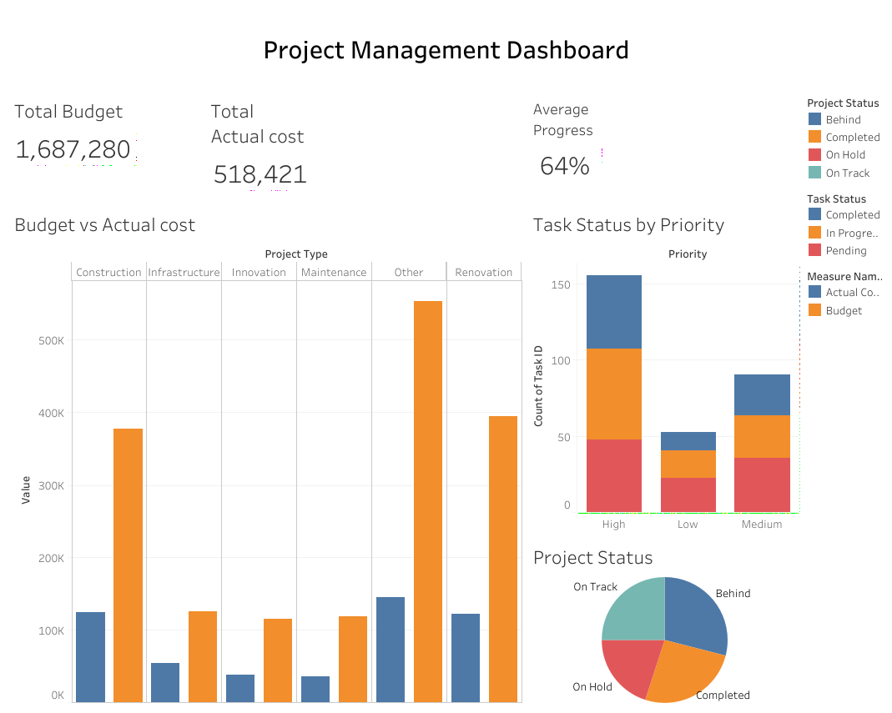

# Project Management Dashboard

An interactive dashboard built in **Tableau Public** to track project budgets, costs, progress and task status.

## Live Dashboard
[View on Tableau Public](https://public.tableau.com/views/ProjectManagementDashboard_17910250978640/Dashboard1?:language=en-GB&:sid=&:redirect=auth&:display_count=n&:origin=viz_share_link)

## Key Metrics
- **Total Budget:** 1,687,280
- **Total Actual Cost:** 518,421
- **Average Progress:** 64%

## Visuals
- Budget vs Actual Cost by Project Type
- Project Status breakdown (Behind, Completed, On Hold, On Track)
- Task Status by Priority (Completed, In Progress, Pending)

## Insights
- Actual cost is well below budget in every project type, which suggests many projects are still in progress.
- "Other" and "Renovation" project types carry the largest budgets.
- High priority tasks make up the largest share of all tasks.

## Dataset
- 300 tasks with fields such as Project Type, Location, Start/End Date, Budget, Actual Cost, Hours Spent, Progress, Task Status and Priority.
- Source: [Hugging Face - JohnVans123/ProjectManagement](https://huggingface.co/datasets/JohnVans123/ProjectManagement)
- This is a sample/synthetic dataset used for portfolio purposes.

## Tools Used
Tableau Public

## Author
P.H.M.C.K. Gunawardhana
HNDPM Student, SLIATE Kegalle
[LinkedIn](https://www.linkedin.com/in/chaveesha-kavindi-gunawardhana-96aa18327)
